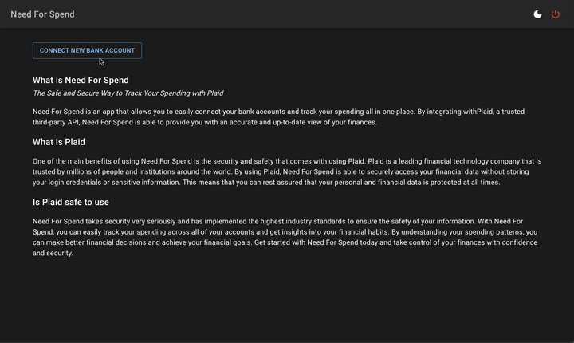

<!-- Improved compatibility of back to top link: See: https://github.com/othneildrew/Best-README-Template/pull/73 -->

<a name="readme-top"></a>

<!--
*** Thanks for checking out the Best-README-Template. If you have a suggestion
*** that would make this better, please fork the repo and create a pull request
*** or simply open an issue with the tag "enhancement".
*** Don't forget to give the project a star!
*** Thanks again! Now go create something AMAZING! :D
-->

<!-- PROJECT SHIELDS -->
<!--
*** I'm using markdown "reference style" links for readability.
*** Reference links are enclosed in brackets [ ] instead of parentheses ( ).
*** See the bottom of this document for the declaration of the reference variables
*** for contributors-url, forks-url, etc. This is an optional, concise syntax you may use.
*** https://www.markdownguide.org/basic-syntax/#reference-style-links
-->

<!-- [![Contributors][contributors-shield]][contributors-url]
[![Forks][forks-shield]][forks-url]
[![Stargazers][stars-shield]][stars-url]
[![Issues][issues-shield]][issues-url]
[![MIT License][license-shield]][license-url]
[![LinkedIn][linkedin-shield]][linkedin-url] -->

<!-- PROJECT LOGO -->
<br />
<div align="center">
  <a href="https://github.com/othneildrew/Best-README-Template">
    
  </a>

  <h3 align="center">Need For Spend</h3>

  <!-- <p align="center">
    An awesome README template to jumpstart your projects!
    <br />
    <a href="https://github.com/othneildrew/Best-README-Template"><strong>Explore the docs »</strong></a>
    <br />
    <br />
    <a href="https://github.com/othneildrew/Best-README-Template">View Demo</a>
    ·
    <a href="https://github.com/othneildrew/Best-README-Template/issues">Report Bug</a>
    ·
    <a href="https://github.com/othneildrew/Best-README-Template/issues">Request Feature</a>
  </p> -->
</div>

<!-- TABLE OF CONTENTS -->
<details>
  <summary>Table of Contents</summary>
  <ol>
    <li>
      <a href="#faq">FAQ</a>
    </li>
    <li>
      <a href="#about-the-project">About The Project</a>
      <ul>
        <li><a href="#built-with">Built With</a></li>
      </ul>
    </li>
    <li>
      <a href="#getting-started">Getting Started</a>
      <ul>
        <li><a href="#prerequisites">Prerequisites</a></li>
        <li><a href="#installation">Installation</a></li>
      </ul>
    </li>
    <li><a href="#usage">Usage</a></li>
    <li><a href="#roadmap">Roadmap</a></li>
    <li><a href="#contributing">Contributing</a></li>
    <li><a href="#license">License</a></li>
    <li><a href="#contact">Contact</a></li>
    <li><a href="#acknowledgments">Acknowledgments</a></li>
  </ol>
</details>

<!-- ABOUT THE PROJECT -->

## About The Project

<!-- [![Product Name Screen Shot][product-screenshot]](https://example.com) -->

### What is Need For Spend

The Safe and Secure Way to Track Your Spending with Plaid
Need For Spend is an app that allows you to easily connect your bank accounts and track your spending all in one place. By integrating withPlaid, a trusted third-party API, Need For Spend is able to provide you with an accurate and up-to-date view of your finances.

### What is Plaid

One of the main benefits of using Need For Spend is the security and safety that comes with using Plaid. Plaid is a leading financial technology company that is trusted by millions of people and institutions around the world. By using Plaid, Need For Spend is able to securely access your financial data without storing your login credentials or sensitive information. This means that you can rest assured that your personal and financial data is protected at all times.

### Is Need For Spend and Plaid safe to use

Need For Spend takes security very seriously and has implemented the highest industry standards to ensure the safety of your information. With Need For Spend, you can easily track your spending across all of your accounts and get insights into your financial habits. By understanding your spending patterns, you can make better financial decisions and achieve your financial goals. Get started with Need For Spend today and take control of your finances with confidence and security.

<p align="right">(<a href="#readme-top">back to top</a>)</p>

<!-- ### Built With

This section should list any major frameworks/libraries used to bootstrap your project. Leave any add-ons/plugins for the acknowledgements section. Here are a few examples.

- [![Next][Next.js]][Next-url]
- [![React][React.js]][React-url]
- [![Vue][Vue.js]][Vue-url]c
- [![Angular][Angular.io]][Angular-url]
- [![Svelte][Svelte.dev]][Svelte-url]
- [![Laravel][Laravel.com]][Laravel-url]
- [![Bootstrap][Bootstrap.com]][Bootstrap-url]
- [![JQuery][JQuery.com]][JQuery-url]

<p align="right">(<a href="#readme-top">back to top</a>)</p> -->

<!-- GETTING STARTED -->

## Getting Started

This is an example of how you may give instructions on setting up your project locally.
To get a local copy up and running follow these simple example steps.

### Prerequisites

This is an example of how to list things you need to use the software and how to install them.

- npm
  ```sh
  npm install npm@latest -g
  ```

### Installation

_Below is an example of how you can instruct your audience on installing and setting up your app. This template doesn't rely on any external dependencies or services._

1. Get your Plaid API keys from the dashboard: [https://dashboard.plaid.com/team/keys](https://dashboard.plaid.com/team/keys)
2. Clone the repo
   ```sh
   git clone https://github.com/jaycchiu524/need-for-spend.git
   ```
3. Install dependencies
   ```sh
   yarn
   ```
4. Add a new `.env` file
   ```sh
   # Add new .env at root
   cp .env.example .env
   ```
   Fill the environment variable from [Plaid](https://dashboard.plaid.com/team/keys) `.env`
   ```plaintext
    PLAID_CLIENT_ID=
    PLAID_SECRET=
    ...
   ```
5. Set up local MySQL database with docker compose
   ```sh
    docker compose -f ./packages/server/docker-compose.yml up -d
   ```
6. Set up database schema and seeding
   ```sh
    yarn workspace server prisma migrate dev
   ```
   <p align="right">(<a href="#readme-top">back to top</a>)</p>

<!-- USAGE EXAMPLES -->

## Usage

- Development

  ```sh
    # root dir
    yarn dev

    # Web client running at localhost:3000
    # Server running at localhost:8080
  ```

<p align="right">(<a href="#readme-top">back to top</a>)</p>

<!-- ROADMAP -->

## Roadmap

- [x] Database schema
- [x] Connect Plaid API with database
- [x] Add Basic UI with MUI
- [x] Add charts with D3.js
- [x] Containerization with Docker
- [ ] Add WebSocket & Webhook for updating data at real time
- [ ] CI: Github Actions
- [ ] CD: AWS App runner deployment

<p align="right">(<a href="#readme-top">back to top</a>)</p>
